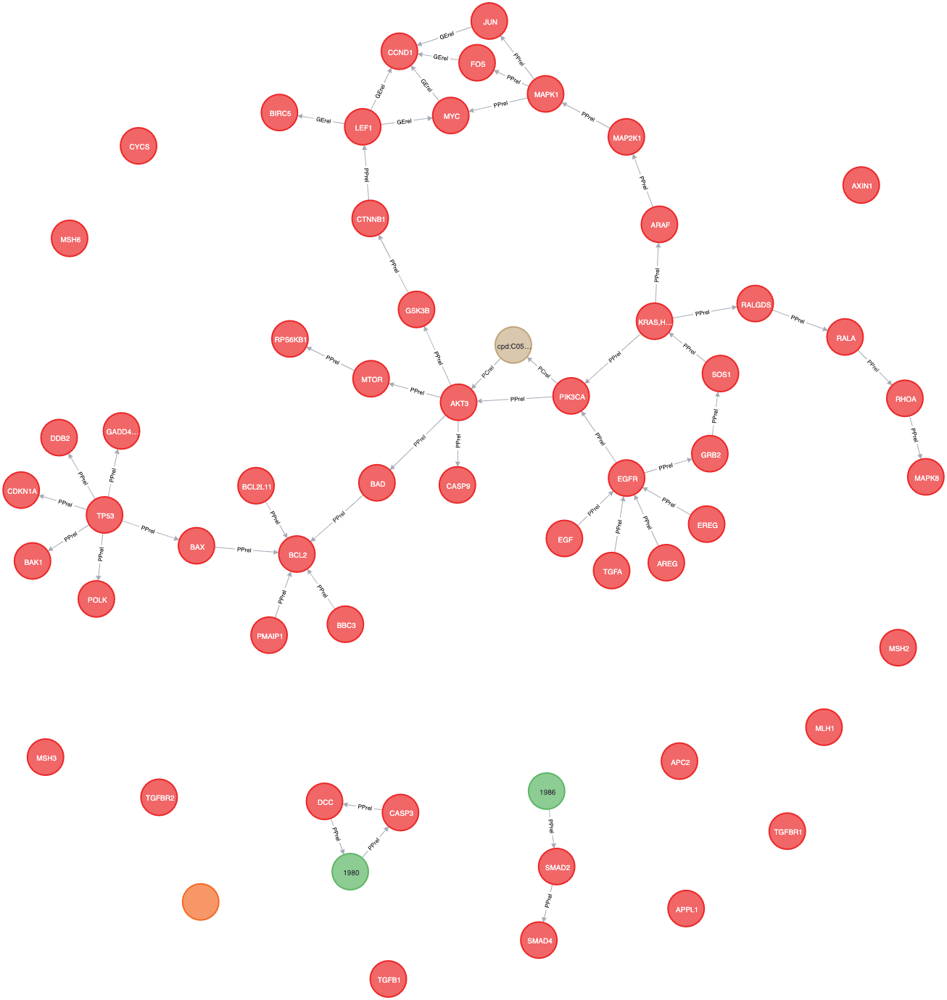

# PathLink

This is the repository containing my 3rd year project research.

## Motivation

There is a significant amount of cancer data available in different formats and places.

This is fine for manual use but even then it is lengthy to use the data to come to any conclusions.

The purpose of this project is to provide an API and graphical interface which provides quick access to cancer-related bioinformatic data along with other data taken from:

* KEGG
* Pathway Commons
* CIViCDB
* ClinVar
* UniProt
* STRING

The system also provides an API to produce comprehensive Neo4j representations of all KEGG pathways - along with mechanisms for enrichment and other analysis.

## Outcomes

The API is a single endpoint that gathers pathway data from multiple sources. It outputs the Cypher queries necessary to produce a comprehensive graph in Neo4j. The outputs look something like this:



These graphs have Genes, Drugs and Compounds together with data on how they interact.

## Structure

### `preliminaries`

These are the files and programs I used for my preliminary research into the Biological Pathways domain prior to the full system design

### `src`

This is the cumulative result of the work so far with a frontend Flask webserver and a REST API.

This frontend accepts structured queries fulfilling the criteria set out in the report.

For more information about running the system, consult src/README.md

### `scripts`

This contains any scripts used to test the system as an outsider.

## Implementation Notes

Some raw datasets need to be pulled into an operational MongoDB database in advance:

* KEGG
* CiViCDB
* ClinVar

This is because their APIs are either unacceptably slow or inflexible.

## Setup

There is a small amount of preliminary setup required.

1. Install dependencies

    This project uses quite a few python3 modules, so install them as follows:
    
    ```bash
    pip3 install -r src/requirements.txt
    ```

2. Install databases

    The project uses mongoDB and Neo4j so ensure that accessible instances of both are available.

    Once these are running, retrieve the information referred to in `src/server_config` and
paste them into the relevant locations.
   
   
3. Populate cache database

    The project uses the mongoDB to cache slow datasets. This can be filled by running:

    ```
   cd scripts/db_management
   ./populate_mongo.sh
    ```
   

4. Run

    The system can now run. This is achieved by ensuring that you are in the System directory
    and executing `./run`.
   
## Usage

- The system has a frontend available via localhost (usually 127.0.0.1/).
This is a comprehensive interface for simple queries.
  
- The system also has a total of 7 API endpoints:

    - /api/pathway
    - /api/gene
    - /api/variant
    - /api/pathway_gene_interaction
    - /api/variant_evidence
    - /api/functional_enrichment
    - /api/pathway_to_cypher
  